# 🛡️ SecureThought AI


> **The world's first threat intelligence platform built on CyborgDB's encryption-native vector database architecture.**

---

## 🔗 Quick Links

| 🚀 **Live Demo** | 📺 **Video Walkthrough** | 💻 **Source Code** |
|:----------------:|:------------------------:|:------------------:|
| [**Launch App (Vercel)**](https://YOUR_VERCEL_LINK_HERE) | [**Watch on YouTube**](https://YOUR_YOUTUBE_LINK_HERE) | [**GitHub Repo**](https://github.com/YOUR_USERNAME/REPO) |

---

## 🏗️ The Architecture
SecureThought AI isn't just a dashboard; it's a demonstration of a **Zero-Trust Vector Architecture**. Below is the blueprint of how we leverage CyborgDB to ensure data never leaks.

### 1. The Secure Enclave (System Overview)
This 3-Tier architecture ensures that the application logic never handles plaintext vectors, and the database only ever sees ciphertext.

```mermaid
graph TD
    subgraph Client ["🖥️ TIER 1: PRESENTATION LAYER (React Client)"]
        UI[Mission Control UI]
        Auth[Biometric Auth]
        Enc[Client-Side Encryption Engine]
    end

    subgraph API ["⚡ TIER 2: LOGIC LAYER (Middleware)"]
        Gateway[API Gateway]
        Agent[Neural Sentry Agent]
        Audit[Immutable Audit Log]
    end

    subgraph DB ["🔒 TIER 3: DATA LAYER (CyborgDB Enclave)"]
        VectorStore[Encrypted Vector Store]
        SearchEng[Homomorphic Search Engine]
        Keys[Hardware Security Module]
    end

    UI --> Auth
    Auth --> Enc
    Enc -- "Encrypted Query (AES-256)" --> Gateway
    Gateway --> SearchEng
    SearchEng -- "Encrypted Results" --> Gateway
    Gateway --> Enc
    Enc -- "Decrypted View" --> UI
    
    style DB fill:#0a0a0a,stroke:#00d4ff,stroke-width:2px
    style Client fill:#0a0a0a,stroke:#a855f7,stroke-width:2px
```



### 2. The Data Flow (Zero-Trust Tunnel)
Unlike traditional DBs where the server decrypts data to search it, CyborgDB performs similarity search **directly on the encrypted data**.

```text
┌──────────────────────┐          ┌──────────────────────┐          ┌──────────────────────┐
│  USER / CLIENT SIDE  │          │   UNTRUSTED NETWORK  │          │   CYBORGDB SERVER    │
├──────────────────────┤          ├──────────────────────┤          ├──────────────────────┤
│                      │          │                      │          │                      │
│ 1. User Types Query  │          │                      │          │ 4. Receive Ciphertext│
│    "Ransomware..."   │          │                      │          │                      │
│          ↓           │          │                      │          │          ↓           │
│ 2. Vectorization     │          │  🔒 Encrypted Payload│          │ 5. Search in Memory  │
│    [0.1, 0.5, ...]   │          │    (AES-256)         │          │    (No Decryption)   │
│          ↓           │          │                      │          │          ↓           │
│ 3. ENCRYPTION (Key)  │─────────▶│  [ 0x7F...3A ]       │─────────▶│ 6. Find Match        │
│    [ 0x7F...3A ]     │          │                      │          │    [ 0x9B...2C ]     │
│          ↑           │          │                      │          │          │           │
│ 8. DECRYPTION (Key)  │◀─────────│  🔒 Encrypted Result │◀─────────│ 7. Return Result     │
│    "WannaCry.exe"    │          │                      │          │                      │
│                      │          │                      │          │                      │
└──────────────────────┘          └──────────────────────┘          └──────────────────────┘
      ✅ SAFE ZONE                      ⚠️ DANGER ZONE                     ✅ SECURE ZONE
```

### 3. The Memory Gap (Why We Win)
The critical vulnerability in all other vector databases is **RAM**. CyborgDB solves this.

```text
❌ TRADITIONAL VECTOR DB              ✅ CYBORGDB ARCHITECTURE
   (Pinecone, Milvus, Weaviate)          (SecureThought AI)

   [ SERVER RAM ]                        [ SERVER RAM ]
   ┌───────────────────────────┐         ┌───────────────────────────┐
   │ vector_id: "user_finance" │         │ vector_id: "user_finance" │
   │ embedding: [0.12, 0.98..] │         │ embedding: "8a7f...b2c9"  │ <── NO PLAINTEXT
   │ metadata: "Salary: $150k" │         │ metadata: "e4d1...9a0f"   │ <── NO PII
   └───────────────────────────┘         └───────────────────────────┘
               ▲                                     ▲
               │                                     │
      ⚠️ MEMORY DUMP ATTACK                 🛡️ MEMORY DUMP ATTACK
      RESULT: DATA STOLEN                   RESULT: GIBBERISH
```

---

## 🚨 The Problem
In the era of Generative AI, **Vector Databases** are the new memory. However, traditional vector databases share a critical vulnerability: **Data must be decrypted to be searched.** 

During high-speed similarity searches, sensitive embeddings (financial data, PII, trade secrets) exist as plaintext in server RAM. A simple memory dump attack exposes everything.

## ⚡ The Solution: SecureThought AI
SecureThought AI is a comprehensive security dashboard that demonstrates **CyborgDB's** unique capability: **Computing on Encrypted Data.**

We provide a Zero-Trust environment where vector data remains encrypted:
1.  **At Rest** (Disk)
2.  **In Transit** (Network)
3.  **In Memory** (During Compute/Search via CyborgDB protocols)

---

## 🌟 Key Features

### 1. 🕹️ Mission Control
Real-time visibility into your security posture. Monitor active threats, ingestion rates, and global encryption status via the CyborgDB Command Hub.

### 2. 🕵️ CyborgDB Threat Hunter
A semantic search engine for security logs that protects your queries.
*   **Encryption Toggle Demo:** A unique interactive switch that allows you to simulate "Unsafe" (Plaintext) vs "Safe" (CyborgDB Encrypted) searches to see the difference in memory exposure.

### 3. 🧠 "Cipher" Neural Sentry
An intelligent agent running on the CyborgDB Neural Core.
*   **Voice Activated:** Speak to your dashboard to analyze threats hands-free.
*   **Encrypted Context:** The AI understands your vectors without exposing them.
*   **Transcript Export:** Download full encrypted audit logs.

### 4. 🧊 3D Vector Visualization
Interactive Three.js visualization of your encrypted vector space. See how threats cluster in high-dimensional space without decrypting the underlying values.

### 5. 👆 Biometric Handshake Login
A fully immersive "Cyberpunk" login experience simulating a biometric key exchange protocol.

### 6. 🛠️ Interactive API Playground
A dedicated developer console to test raw CyborgDB endpoints and generate code snippets.

---

## 🛠️ Tech Stack

*   **Database:** CyborgDB (Mocked for Demo)
*   **Frontend:** React 18, TypeScript, Vite
*   **Styling:** Tailwind CSS (Custom Cyberpunk Design System)
*   **Visualization:** Three.js, Recharts
*   **AI Engine:** CyborgDB Neural Interface (via LLM Integration)

---

## 🚀 Getting Started

### Prerequisites
*   Node.js 18+
*   npm or yarn

### Installation

1.  **Clone the repository**
    ```bash
    git clone https://github.com/SecureThoughtAI/platform.git
    cd platform
    ```

2.  **Install dependencies**
    ```bash
    npm install
    ```

3.  **Configure CyborgDB Access**
    Open `services/ai.ts` and paste your **CyborgDB API Key** (or compatible LLM key for the demo):
    ```typescript
    // services/ai.ts
    const CYBORGDB_API_KEY = 'YOUR_KEY_HERE';
    ```

4.  **Run the secure enclave**
    ```bash
    npm run dev
    ```

5.  **Access the platform**
    Navigate to `http://localhost:5173`

---

## 👥 Team SecureThoughtAI

Built with 💻 and ☕ for the **CyborgDB Hackathon**.

*© 2024 SecureThought AI. All Systems Encrypted.*
